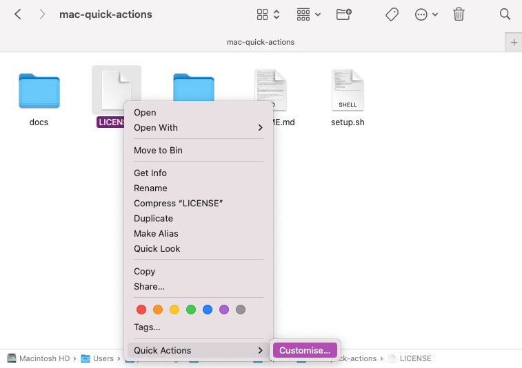
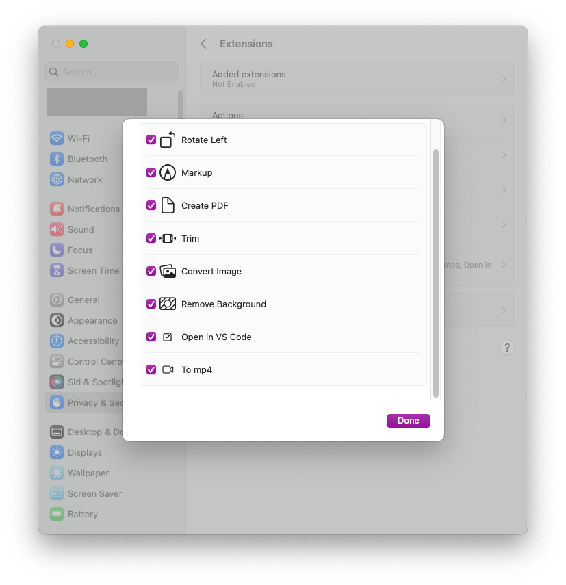
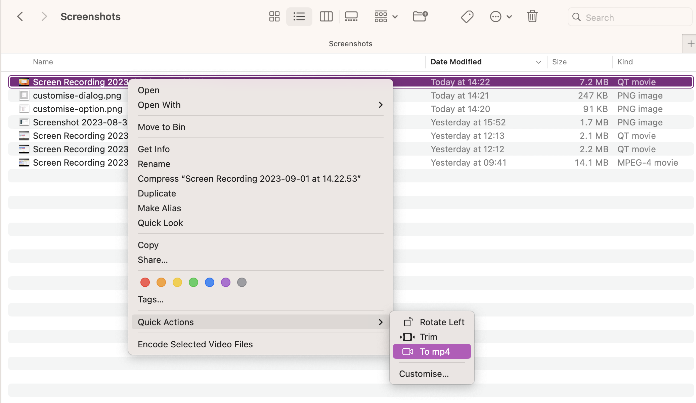
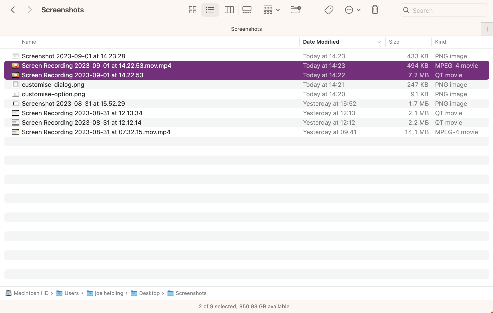

# quick-actions

This repo will help you set up some quick actions on macOS.

Feel free to fork/contribute with any other hacks you and others might find useful!

## How to add the quick actions

Once you've run the `setup.sh` script, you will need to add the quick action to the Quick Actions menu.

Right click on any file, go to "Quick Actions" and then "Customise..."

Check the actions that you want to add to the bottom of the list and then click "Done"

## How this works

The `./quick-actions` folder contains packaged [Automator](https://support.apple.com/en-gb/guide/automator/welcome/mac) scripts.

The scripts are effectively just shell scripts that run in a bit of a weird environment where some PATH variables (like those from homebrew) won't be loaded.

The `setup.sh` script will install [ffmpeg](https://ffmpeg.org/) through homebrew, and replace the placeholder variable `@@FFMPEGLOCATION@@` in all `document.wflow` files in the packaged automator script files under ./quick-actions

It will then move (and replace) the automator packages in their installed locations.

## Uninstalling

To remove any packages you may no longer want, navigate to `~/Library/Services` and simply delete what you no longer want

## Editing

If you want to edit an existing action, open "Automator" and import it. Make any changes in there, export it, and simply replace the existing package in the repo.

If you want to add a new package, build it in "Automator" and then use "File/Export" to export it. If you added any new commands that rely on certain software being installed, you will likely need to replace the alias'd command with the actual location. In which case, please expand the `setup.sh` file to ensure it will also work for others. Use the existing `sed` command as a template.

# Actions

## To mp4

Right click the video again and you should see the "To mp4" action in the Quick Actions menu.

Doing this will convert and compress the video file into .mp4 format - especially useful for screen recordings.

The existing file will remain untouched, so you will always have it as a backup.

## Open in VS Code

When you're about to open a file, you can right-click it, and select "Open with" to select your app from there. This doesn't work for folders however.

This action will let you open folders that you're viewing in Finder with VS Code

